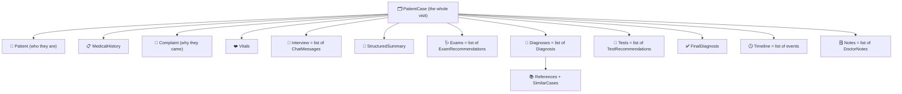

# SEHATI-AI — Data Model (Entities & Database)

This page explains **every piece of data** in the system in plain language: what
each "entity" is, what fields it has, and how they're stored. You do not need to
read any code to understand it.

- **Part A — The big picture:** how the data is organised.
- **Part B — Every entity, field by field.**
- **Part C — The database tables** (where it physically lives on AWS).

Throughout, *"optional"* means the field may be absent; everything else is
normally present.

---

## Part A — The big picture

Everything centres on **one entity: the Case** (`PatientCase`). A Case is a single
patient's visit, and it **contains everything about that visit** — the patient's
details, the chat with the AI, the summary, the diagnoses, the tests, the timeline,
the doctor's notes, and so on. All the other entities below are *pieces of a Case*.

When the app asks for a Case, it gets **one big JSON object** with all of this
inside it. That JSON shape is identical to what the frontend already uses
(`src/types.ts`), so nothing has to be translated.

**A note on numbers:** confidence, similarity, diagnostic value and pain are all
plain numbers on a 0–100 scale (pain is 0–10). Higher = more/stronger.

---

## Part B — Every entity, field by field

### 1. `PatientCase` — the whole visit (the central entity)

| Field | Type | Meaning |
|-------|------|---------|
| `id` | text | Unique case id, e.g. `AUR-1042`. Used everywhere to refer to this case. |
| `patient` | *Patient* | Who the patient is (see entity 2). |
| `history` | *MedicalHistory* | Their background health (entity 3). |
| `complaint` | *Complaint* | What brought them in (entity 4). |
| `vitals` | *Vitals* | Blood pressure, heart rate, etc. (entity 5). |
| `status` | text | Human-friendly stage label shown in the UI, e.g. "Awaiting Tests". |
| `stage` | text | Machine key for the same idea, e.g. `tests`. Drives the progress bar. |
| `lifecycleState` | text | The **authoritative** backend state, e.g. `InProgress` (see [`WORKFLOW.md`](./WORKFLOW.md)). |
| `priority` | text | `High`, `Medium`, or `Low`. |
| `createdAt` / `updatedAt` | text | When the case was created / last changed. |
| `chiefComplaint` | text | One-line reason for the visit. |
| `primaryImpression` | text | The current leading diagnosis, in one line. |
| `interview` | list of *ChatMessage* | The full AI ↔ patient conversation (entity 6). |
| `summary` | *StructuredSummary* | The AI's tidy summary for the doctor (entity 7). |
| `exams` | list of *ExamRecommendation* | Physical exams to do / done (entity 8). |
| `diagnoses` | list of *Diagnosis* | The ranked differential (entity 9). |
| `tests` | list of *TestRecommendation* | Investigations to order / results (entity 11). |
| `finalDiagnosis` | *FinalDiagnosis*, optional | The signed-off conclusion (entity 12). Absent until proposed. |
| `timeline` | list of *TimelineEvent* | Chronological history of the case (entity 13). |
| `notes` | list of *DoctorNote* | Free-text notes the doctor wrote (entity 14). |
| `insights` | list of *AIInsight* | AI "heads-up" cards, e.g. a safety flag (entity 15). |
| `nextSteps` | list of text | Suggested next actions, shown as a checklist. |
| `recentUpdates` | list | Short "what just happened" feed items. |
| `assistantThread` | list of *ChatMessage* | The case-level chat with the AI assistant panel. |
| `progress` | list of *ProgressStep* | The stage tracker shown as a stepper (entity 16). |
| `outcome` | text, optional | Final outcome once closed. |
| `lessonsLearned` | list of text, optional | Retrospective notes on completed cases. |
| `associatedConditions` | list of text, optional | Related conditions noted at closure. |
| `patientId` | text | **Ownership:** the Cognito id of the patient who owns this case. Used to enforce isolation. |
| `assignedPhysicianId` | text, optional | **Ownership:** the doctor assigned to the case. |

> `patientId` and `assignedPhysicianId` are **backend-only** (the UI never shows
> them). They are how the system decides who is allowed to open the case.

---

### 2. `Patient` — who the patient is

| Field | Type | Meaning |
|-------|------|---------|
| `name` | text | Full name. |
| `age` | number | Age in years. |
| `gender` | text | `Male`, `Female`, or `Other`. |
| `weight` / `height` | text | e.g. "82 kg" / "178 cm". |
| `bmi` | text, optional | Body-mass index. |
| `bloodType` | text, optional | e.g. "O+". |
| `occupation` | text, optional | Job (can hint at exposures/risks). |
| `avatarHue` | number, optional | A colour used to generate the avatar in the UI. |

### 3. `MedicalHistory` — background health

| Field | Type | Meaning |
|-------|------|---------|
| `previousIllnesses` | list of text | Known conditions, e.g. "Type 2 diabetes". |
| `medications` | list of text | Current medicines with doses. |
| `allergies` | list of text | Known allergies (e.g. "Penicillin"). |
| `familyHistory` | list of text | Relevant family conditions. |
| `surgeries` | list of text | Past operations. |
| `lifestyle` | text | Free-text lifestyle summary. |
| `smoking` | text | Smoking status/history. |
| `alcohol` | text | Alcohol use. |

### 4. `Complaint` — why they came in

| Field | Type | Meaning |
|-------|------|---------|
| `symptoms` | list of text | The presenting symptoms. |
| `painScale` | number (0–10) | Self-reported pain. |
| `duration` | text | How long it's been going on, e.g. "4 days". |
| `timeline` | text | How it evolved. |
| `aggravating` | text | What makes it worse. |
| `relieving` | text | What makes it better. |

### 5. `Vitals` — bedside measurements

| Field | Type | Meaning |
|-------|------|---------|
| `bp` | text, optional | Blood pressure, e.g. "145/90". |
| `hr` | text, optional | Heart rate. |
| `rr` | text, optional | Respiratory rate. |
| `spo2` | text, optional | Oxygen saturation, e.g. "92%". |
| `temp` | text, optional | Temperature, e.g. "38.6°C". |

### 6. `ChatMessage` — one line of conversation

Used in the interview, the diagnosis discussion, and the assistant panel.

| Field | Type | Meaning |
|-------|------|---------|
| `role` | text | Who spoke: `ai`, `patient`, `doctor`, or `system`. |
| `text` | text | What was said. |
| `time` | text, optional | Timestamp/label. |

### 7. `StructuredSummary` — the AI's tidy write-up for the doctor

| Field | Type | Meaning |
|-------|------|---------|
| `chiefComplaint` | text | One-sentence summary of the presentation. |
| `hpi` | text | "History of Present Illness" — the narrative. |
| `relevantHistory` | list of text | Background that matters for this case. |
| `medications` | list of text | Current medications. |
| `riskFactors` | list of text | Things that raise risk. |
| `redFlags` | list of text | Warning signs to act on. |
| `timeline` | list of `{time, event}` | How symptoms unfolded. |
| `symptoms` | list of text | Symptom list. |
| `findings` | list of text | The AI's key observations. |

### 8. `ExamRecommendation` — a physical examination

| Field | Type | Meaning |
|-------|------|---------|
| `id` | text | Id within the case, e.g. `e1`. |
| `name` | text | The exam, e.g. "Chest Auscultation". |
| `reason` | text | Why it's recommended. |
| `importance` | text | `Critical`, `Important`, or `Routine`. |
| `confidence` | number (0–100) | How useful the AI thinks it is. |
| `status` | text | `pending`, `complete`, or `skipped`. |
| `finding` | text, optional | What the doctor found (filled in after). |
| `normalRange` | text, optional | The normal range for reference. |
| `flag` | text, optional | `normal`, `abnormal`, or `critical`. |
| `note` | text, optional | Extra note. |

### 9. `Diagnosis` — one possibility on the differential

This is the richest entity — it carries the AI's full reasoning so the doctor can
interrogate it.

| Field | Type | Meaning |
|-------|------|---------|
| `id` | text | Id within the case, e.g. `dx-cap`. |
| `name` | text | The diagnosis, e.g. "Community-acquired Pneumonia". |
| `confidence` | number (0–100) | How likely the AI thinks it is (a qualitative judgment, **not** a statistical probability). |
| `priority` | text | `High` / `Medium` / `Low`. |
| `category` | text | Grouping, e.g. "Respiratory infection". |
| `tagline` | text | One-line description. |
| `reasoning` | text | The AI's explanation of why it's considered. |
| `supporting` | list of text | Evidence *for* this diagnosis. |
| `contradicting` | list of text | Evidence *against* / not yet confirmed. |
| `missing` | list of text | Information that would help decide. |
| `recommendedTests` | list of text | Tests that would clarify it. |
| `confidenceExplanation` | text | How the confidence number was arrived at. |
| `whyNot100` | text | Why it isn't certain — the honest caveat. |
| `riskAssessment` | text | Severity / how urgent. |
| `nextAction` | text | The immediate suggested next step. |
| `references` | list of *Reference* | The citations behind it (entity 10). |
| `similarCases` | list of *SimilarCase* | Comparable past cases (entity 10). |
| `trend` | list of `{label, value}` | How confidence evolved over the case (for the chart). |
| `discussion` | list of *ChatMessage* | The doctor↔AI chat about *this* diagnosis ("Why this?"). |

### 10. `Reference` and `SimilarCase` — the evidence behind a diagnosis

**Reference** (a citation):

| Field | Type | Meaning |
|-------|------|---------|
| `type` | text | `guideline`, `paper`, `textbook`, or `case`. |
| `title` | text | Title of the source. |
| `source` | text | Journal/book/body it came from. |
| `year` | number, optional | Year. |
| `snippet` | text | The relevant quoted passage. |
| `strength` | text, optional | `Strong`, `Moderate`, or `Supportive`. |

**SimilarCase** (a comparable past case, at cohort level — no identities):

| Field | Type | Meaning |
|-------|------|---------|
| `title` | text | Anonymised descriptor, e.g. "61 M, diabetic, RLL pneumonia". |
| `outcome` | text | What happened. |
| `similarity` | number (0–100) | How similar to the current case. |
| `detail` | text | Extra context. |

### 11. `TestRecommendation` — an investigation to order

| Field | Type | Meaning |
|-------|------|---------|
| `id` | text | Id within the case, e.g. `t1`. |
| `name` | text | The test, e.g. "Chest X-ray". |
| `category` | text | e.g. "Imaging", "Hematology". |
| `reason` | text | Why it's suggested. |
| `expectedFinding` | text | What the AI expects it to show. |
| `priority` | text | `High` / `Medium` / `Low`. |
| `cost` | text | Rough cost, e.g. "$", "$$". |
| `urgency` | text | e.g. "Immediate", "Routine". |
| `diagnosticValue` | number (0–100) | How much it will help decide. |
| `status` | text | `recommended` → `ordered` → `pending` → `completed`. |
| `result` | text, optional | The result once back. |
| `resultFlag` | text, optional | `normal`, `abnormal`, or `critical`. |
| `resultDetail` | text, optional | Extra detail on the result. |

### 12. `FinalDiagnosis` — the signed-off conclusion

| Field | Type | Meaning |
|-------|------|---------|
| `name` | text | The final diagnosis. |
| `confidence` | number (0–100) | Final confidence band. |
| `status` | text | `proposed` (AI suggested) or `accepted` (doctor signed off). |
| `reasoning` | text | Why this is the conclusion. |
| `evidenceSummary` | list of text | The clinching evidence. |
| `ruledOut` | list of `{name, reason}` | Alternatives excluded, and why. |
| `treatment` | list of text | The management plan. |
| `monitoring` | list of text | What to keep watching. |
| `complications` | list of text | Things to watch out for. |
| `followUp` | list of text | Follow-up actions. |

### 13. `TimelineEvent` — one entry in the case history

| Field | Type | Meaning |
|-------|------|---------|
| `time` / `date` | text | When it happened. |
| `title` | text | Short headline. |
| `description` | text | Detail. |
| `actor` | text | `patient`, `ai`, `doctor`, or `system`. |
| `stage` | text | Which stage it belongs to. |

### 14. `DoctorNote`

| Field | Type | Meaning |
|-------|------|---------|
| `time` | text | When written. |
| `author` | text | Which doctor. |
| `text` | text | The note. |

### 15. `AIInsight` — a heads-up card

| Field | Type | Meaning |
|-------|------|---------|
| `kind` | text | `info`, `warning`, `success`, `suggestion`, or `critical`. |
| `title` | text | Short headline. |
| `text` | text | The message. |

### 16. `ProgressStep` — one dot in the stage tracker

| Field | Type | Meaning |
|-------|------|---------|
| `key` | text | Stage key, e.g. `tests`. |
| `label` | text | Human label, e.g. "Tests Ordered". |
| `status` | text | `done`, `active`, or `pending`. |

---

## Part C — The database tables (where this lives on AWS)

All data is stored in **Amazon DynamoDB**, a serverless database. There are **three
tables**. Every table is encrypted with a dedicated key and bills only for what you
use (near-zero when idle).

### Table 1 — `sehati-cases` (the cases)

- **One row = one whole Case** (the big JSON object from Part B).
- **Primary key:** `id` (the case id). Fetching a case by id is a single, instant lookup.
- **Three extra indexes** for listing cases quickly:
  | Index | Lets you ask… |
  |-------|---------------|
  | `byPatient` | "all cases belonging to *this patient*" (used to scope patients to their own data) |
  | `byPhysician` | "all cases assigned to *this doctor*" |
  | `byStatus` | "all cases at a given status" (e.g. all "Awaiting Tests") |

### Table 2 — `sehati-audit` (the permanent audit trail)

- **One row = one recorded action** (e.g. "doctor ordered test t1").
- **Key:** `caseId` + a sortable timestamp, so a case's entire history is one query,
  in order.
- Each row records: **who** (`actor` + their groups), **what** (`action`), **when**
  (`ts`), the **AI version** used (`modelVersion`), the **evidence** the AI used
  (`retrievedContext`), and the **output**.
- **Append-only.** In production it is also mirrored to a tamper-proof S3 WORM store.
- Only **compliance/admin** roles can read it.

### Table 3 — `sehati-feedback` (the feedback flywheel)

- **One row = one accept/reject/edit** by a doctor.
- **Key:** `caseId` + timestamp.
- Records: the **doctor** (`physicianId`), whether it was an `accept`/`reject`/`edit`
  (`kind`), **what** it was about (`targetType` + `targetId`), the **reason**, the AI
  **version**, and the **evidence** at the time.
- This is the dataset used later to safely improve the AI (without changing the
  model now — see [`ARCHITECTURE.md`](./ARCHITECTURE.md) §6).

---

**Next:** read [`WORKFLOW.md`](./WORKFLOW.md) to see how these entities are created
and updated as a case moves through its life, then [`API.md`](./API.md) for the
exact endpoint inputs and outputs.
