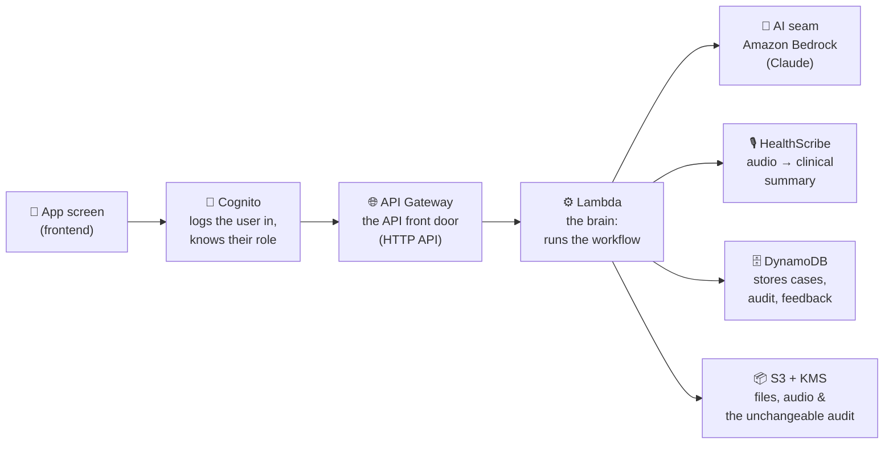

# SEHATI-AI Backend — Documentation

**Start here.** This folder explains the SEHATI-AI backend so you can understand,
run, deploy, and hand it off **without reading the source code**. Read the pages
in this order:

| # | Document | What it answers |
|---|----------|-----------------|
| 1 | **This page** (`README.md`) | What the system is, the big picture, the moving parts, the vocabulary. |
| 2 | [`DATA_MODEL.md`](./DATA_MODEL.md) | Every "entity" (a Case, a Diagnosis, a Test…) and every field, in plain language. Also the database tables. |
| 3 | [`WORKFLOW.md`](./WORKFLOW.md) | The clinical journey step by step: who does what, in what order, and which endpoints get called. |
| 4 | [`API.md`](./API.md) | Every endpoint: what it **wants** (inputs) and what it **sends back** (outputs), with examples. |
| 5 | [`AWS_DEPLOYMENT.md`](./AWS_DEPLOYMENT.md) | How to put it on AWS, as separate **task sets** you do one at a time. |
| 6 | [`ARCHITECTURE.md`](./ARCHITECTURE.md) | Deeper mapping to the original design document + design decisions. |
| 7 | [`VERIFY_CHECKLIST.md`](./VERIFY_CHECKLIST.md) | End-to-end verification: touch every AWS service and confirm it's configured the way the code expects. |

There is also a [`../backend/README.md`](../backend/README.md) (how to run it on
your laptop) and [`../infra/README.md`](../infra/README.md) (the deployment code).

---

## 1. What is this, in one paragraph?

SEHATI-AI is an **AI clinical co-pilot** for hospital doctors. A patient describes
their symptoms; an AI interviews them and writes a tidy summary; the doctor opens
the case, gets a ranked list of possible diagnoses **with the reasoning and
citations behind each one**, orders tests, discusses the results with the AI, and
finally signs off a diagnosis. The AI **never decides** — it advises, and the
doctor accepts or rejects everything. This repository is the **backend**: the
"engine room" that stores the cases, runs that workflow, guards the data, and
offers an API for the app screens to call.

## 2. What this backend is (and is not) responsible for

**It owns:**
- The **data** — every patient case and its full history.
- The **workflow** — the rules for how a case moves from intake to closure.
- The **API** — the set of endpoints the app calls.
- **Security** — who is allowed to see and do what.
- The **audit trail** — an unchangeable log of everything that happened.

**It does NOT own (handled by other teams / plugged in later):**
- The **screens/UI** — that's the frontend team. This backend just feeds them data.
- **Tuning the AI model itself** (prompts, RAG corpus, guardrails) — that's the AI
  team's territory. The backend calls the AI through a small "plug" (see §5); there
  is no offline/stand-in mode — every deploy talks to real Amazon Bedrock.

## 3. The moving parts (what runs where on AWS)

Think of a request flowing left to right:

In plain terms:

| Part | AWS service | Its one job |
|------|-------------|-------------|
| **Front door** | Amazon API Gateway (an HTTP API) | Receives every request from the app and routes it. |
| **Login & roles** | Amazon Cognito | Confirms who the user is and which group they belong to (patient / physician / admin / compliance). |
| **The brain** | AWS Lambda (Python) | Runs the actual logic for every request. This is where our code lives. |
| **The AI plug** | The "AI seam" inside Lambda | Where AI answers come from: Amazon Bedrock (Claude). No stand-in mode. |
| **Transcription** | AWS HealthScribe (via Amazon Transcribe) | Turns a doctor-uploaded audio recording into a structured clinical summary. |
| **The database** | Amazon DynamoDB (7 tables) | Stores cases, the audit log, doctor feedback (both the accept/reject dataset and free-text notes), the shared reference-document library, plus admin-panel accounts and permission groups. |
| **Files & WORM audit** | Amazon S3 + KMS | Stores documents/audio/images and a permanent, tamper-proof copy of the audit. |

Everything is **serverless** — there are no servers to manage, it costs almost
nothing when idle, and it scales automatically.

## 4. The vocabulary (words used everywhere in these docs)

| Word | Meaning |
|------|---------|
| **Case** | One patient's visit, from first symptom to final diagnosis. The central "thing" in the whole system. Everything else hangs off a case. |
| **Entity** | A structured piece of data with named fields — e.g. a *Patient*, a *Diagnosis*, a *Test*. Explained one by one in [`DATA_MODEL.md`](./DATA_MODEL.md). |
| **Endpoint** | One action the app can ask for — e.g. "create a case", "get the next interview question". Listed in [`API.md`](./API.md). |
| **Lifecycle / State** | Which stage a case is at (Intake → AIInterview → … → Closed). The rules for moving between stages are the "state machine". |
| **Role / Group** | What kind of user someone is: **patient**, **physician**, **admin**, or **compliance** (a fixed Cognito group — decides whose *data* you can see). |
| **Permission group** | A separate, admin-editable bundle of fine-grained permissions (e.g. "manage exams", "sign off diagnoses") assigned to a user on top of their role — decides which *actions* you can take. Managed in the `/admin` panel; see [`API.md`](./API.md)'s admin section and [`ARCHITECTURE.md`](./ARCHITECTURE.md) §5. |
| **The AI seam** | The single connection point to the AI: Amazon Bedrock. No stand-in/offline mode. |
| **Audit trail** | A permanent, append-only log: who did what, when, with which AI version, and what evidence was used. For medico-legal safety. |
| **Feedback flywheel** | Every time a doctor accepts or rejects an AI suggestion, we save it (with the reason). This becomes training data later — safely, without changing the model now. |
| **Doctor feedback** | A separate, free-text "leave a note" feature (`POST /cases/{caseId}/feedback`) — distinct from the feedback flywheel above. Stored per doctor, and folded back into that doctor's future AI prompts as a preference history. |

## 5. The AI seam (why the AI team isn't blocked, and you're not blocked either)

The backend never calls a model directly. It calls a small, fixed set of AI
"questions" (give me the next interview question, summarise this case, rank the
diagnoses, answer this doctor's question, …). Behind that sits one
implementation: real Claude reasoning via **Amazon Bedrock**, with safety
Guardrails and a medical-literature knowledge base. This is the file the
**AI team** owns and tunes. There is no offline/no-cost stand-in — see
[`AWS_DEPLOYMENT.md`](./AWS_DEPLOYMENT.md) Task Set 8 for prerequisites.

## 6. How safety is built in (the short version)

- **The AI is never the gatekeeper.** Whether you can see a case is decided by the
  database access layer based on *who you are*, not by asking the AI nicely. A
  patient physically cannot retrieve another patient's case.
- **The doctor is always in the loop.** The AI proposes *lists of options*, never a
  single directive. Nothing is final until a physician signs off.
- **Rejections need a reason.** To reject an AI suggestion you must say why — this
  prevents mindless rubber-stamping and creates useful feedback.
- **Everything is logged, permanently.** Each action is written to an audit trail
  (and, in production, to a tamper-proof WORM store).
- **Data is encrypted** at rest (with a dedicated key) and in transit.

## 7. What "done" looks like

- Run it on your laptop with **no AWS account**: `python backend/scripts/local_invoke.py`
  drives a whole case from intake to closure and prints each step (details in
  [`../backend/README.md`](../backend/README.md)).
- Put it on AWS by following [`AWS_DEPLOYMENT.md`](./AWS_DEPLOYMENT.md) task sets.
- Hand the frontend team four values (API URL + three Cognito ids) and point them
  at [`API.md`](./API.md).

> **Not a medical device.** SEHATI-AI is decision *support*: it shows option lists
> and the evidence behind them for a licensed physician to review independently.
> It never diagnoses a patient directly and raises no time-critical alarms.
