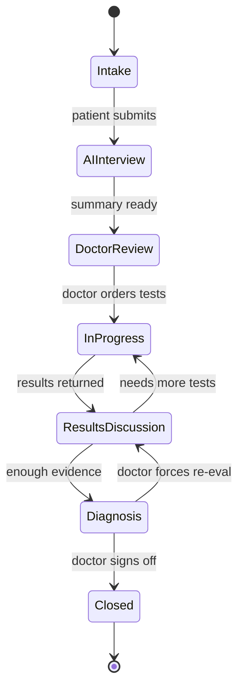
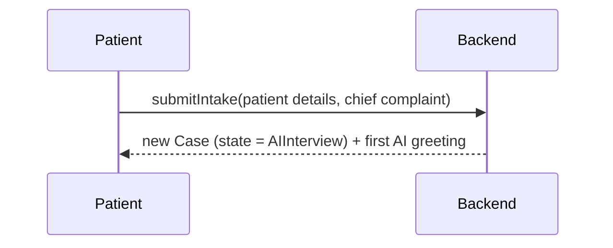
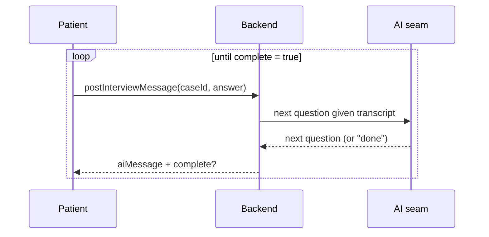
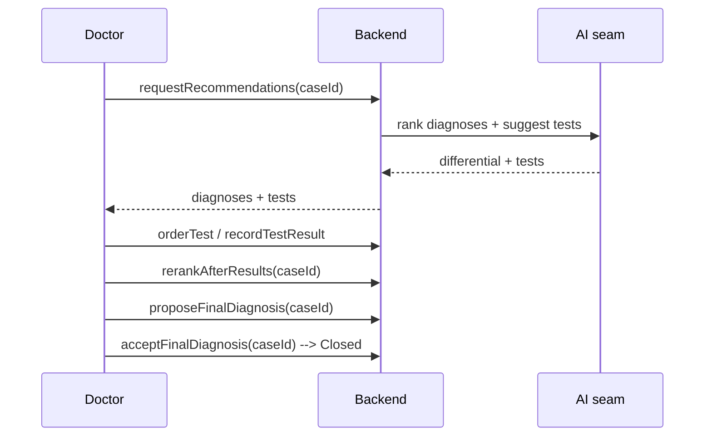

# SEHATI-AI — The Workflow (How a Case Moves)

This page walks a case through its whole life, from the moment a patient describes
their symptoms to the moment a doctor closes the case. For each step you'll see:
**who acts**, **what happens**, **which endpoint is called**, and **how the case
changes**. Exact endpoint inputs/outputs are in [`API.md`](./API.md); the entities
mentioned are in [`DATA_MODEL.md`](./DATA_MODEL.md).

---

## 1. The stages (the "state machine")

A case is always in exactly one **lifecycle state**. It can only move along allowed
arrows — the backend rejects illegal jumps (e.g. you cannot go straight from Intake
to Closed).

Each state also maps to the friendlier `status`/`stage` labels the UI shows (e.g.
`InProgress` → "Awaiting Tests"). You don't manage that mapping — the backend keeps
them in sync.

| Lifecycle state | UI status | What it means |
|-----------------|-----------|---------------|
| `Intake` | New | Case just created; details captured. |
| `AIInterview` | AI Interview | AI is interviewing the patient. |
| `DoctorReview` | Doctor Review | Summary ready; doctor examines and reviews. |
| `InProgress` | Awaiting Tests | Tests have been ordered; waiting on results. |
| `ResultsDiscussion` | Diagnosis in Progress | Results are in; AI + doctor reason over them. |
| `Diagnosis` | Diagnosis in Progress | A final diagnosis has been proposed. |
| `Closed` | Completed | Doctor signed off; record retained immutably. |

---

## 2. The journey, step by step

Below, **P** = patient, **D** = doctor (physician), **AI** = the AI seam,
**Sys** = the backend.

### Step 1 — Intake (patient arrives)
- **Who:** Patient (or a nurse on their behalf).
- **What:** Staff enter just the patient's name, then hand the device over —
  Patient Mode (`/cases/:id/patient-mode`), a full-screen chat, gathers
  everything else conversationally.
- **Endpoint:** `submitIntake`
- **Result:** A brand-new **Case** is created, owned by that patient, and it
  immediately moves **Intake → AIInterview**. The AI's opening greeting is added to
  the interview.

### Step 2 — AI interview (adaptive Q&A)
- **Who:** Patient ↔ AI.
- **What:** The patient answers; the AI asks the next targeted question. Repeat
  until the AI has enough. **This path is locked down** — the AI here has no ability
  to look at any other case.
- **Endpoint:** `postInterviewMessage` (called once per patient answer, in a loop).
- **Result:** Each turn is appended to the case's `interview`. When the AI decides
  it's done, the response says `complete: true`.

### Step 3 — Summary (hand-off to the doctor)
- **Who:** Triggered when the interview is complete.
- **What:** The AI turns the raw chat into a **StructuredSummary** (chief complaint,
  history, red flags, timeline…).
- **Endpoint:** `generateSummary`
- **Result:** `summary` is filled in and the case moves **AIInterview → DoctorReview**.
  The doctor now has a tidy write-up instead of a raw transcript.

### Step 4 — Doctor review & examination
- **Who:** Doctor.
- **What:** Opens the case, reads the summary, and does a physical examination. The
  AI can suggest which exams matter; the doctor records findings.
- **Endpoints:** `getCase` (open it), `recommendExams` (get suggested exams),
  `recordExamFinding` (enter each finding).
- **Result:** `exams` get their `finding`/`flag` filled in.

### Step 5 — Differential diagnosis (the ranked possibilities)
- **Who:** Doctor asks; AI produces.
- **What:** The AI returns a **ranked list of Diagnoses**, each with reasoning,
  supporting/contradicting evidence, a confidence band, citations, and recommended
  tests. It also proposes the tests to order.
- **Endpoint:** `requestRecommendations`
- **Result:** `diagnoses` and `tests` are populated; the leading one becomes the
  `primaryImpression`.

### Step 6 — Interrogate the AI (explainability)
- **Who:** Doctor ↔ AI.
- **What:** The doctor challenges the reasoning — "Why this?", "Why not pulmonary
  embolism?", "What would increase your confidence?" — and gets grounded answers.
- **Endpoints:** `askDiagnosis` (about a specific diagnosis) or `assistantChat`
  (about the case in general).
- **Result:** The exchange is saved into that diagnosis's `discussion` (or the
  case `assistantThread`). Nothing else changes — this is pure explanation.

### Step 7 — Order tests
- **Who:** Doctor.
- **What:** Accepts some recommended tests and orders them.
- **Endpoint:** `orderTest` (once per test).
- **Result:** The test's status becomes `ordered`. **The first order moves the case
  DoctorReview → InProgress** ("Awaiting Tests").

> Optional but encouraged: `acceptRecommendation` / `rejectRecommendation` record
> the doctor's decision (a rejection **must** include a reason). This feeds the
> feedback flywheel and the audit trail.

### Step 8 — Results come back
- **Who:** Doctor / lab system.
- **What:** Enters each result (including a radiologist's report as text — the AI
  never reads the image itself).
- **Endpoint:** `recordTestResult`
- **Result:** The test's `result`/`resultFlag` are filled in and a timeline entry
  is added.

### Step 9 — Re-reason over the results
- **Who:** Doctor asks; AI re-ranks.
- **What:** With results in hand, the AI updates the differential — confidences
  shift, the order may change.
- **Endpoint:** `rerankAfterResults`
- **Result:** `diagnoses` are updated and the case moves **InProgress →
  ResultsDiscussion**. If more tests are needed, the doctor can loop back to
  ordering tests.

### Step 10 — Propose the final diagnosis
- **Who:** Doctor asks; AI proposes.
- **What:** The AI proposes a **FinalDiagnosis** with an evidence summary, the
  alternatives it ruled out, and a treatment/monitoring/follow-up plan — with an
  honest confidence band.
- **Endpoint:** `proposeFinalDiagnosis`
- **Result:** `finalDiagnosis` is set (status `proposed`) and the case moves
  **ResultsDiscussion → Diagnosis**.

### Step 11 — Doctor signs off (or sends it back)
- **Who:** Doctor.
- **What:** Accepts the final diagnosis (optionally with a note). Or, if not
  convinced, forces a re-evaluation back to results discussion.
- **Endpoint:** `acceptFinalDiagnosis` (to sign off), or `setCaseState` back to
  `ResultsDiscussion` (to re-open).
- **Result:** On accept, `finalDiagnosis.status` becomes `accepted` and the case
  moves **Diagnosis → Closed**. The complete record is retained immutably.

---

## 3. Who is allowed to do what (roles)

Every request carries the user's **role** (from their Cognito login). The backend
checks it before acting.

| Role | Can do |
|------|--------|
| **patient** | Create their own case, do the interview, read **only their own** cases. |
| **physician** | Everything clinical: exams, differential, tests, results, propose & **sign off** diagnoses, on any case. |
| **admin** | Everything a physician can, plus read the audit trail. |
| **compliance** | Read cases and the **audit trail**; supports clinical steps but cannot sign off a diagnosis. |

The golden rule: **a patient can never see another patient's case.** This is
enforced by the database access layer, not by the AI. See [`ARCHITECTURE.md`](./ARCHITECTURE.md) §5.

---

## 4. What gets recorded automatically

You don't have to do anything for these — they happen on every relevant action:

- **Audit trail** (`sehati-audit`): every meaningful action is logged with who/what/
  when/AI-version/evidence. Compliance can read it via `caseAudit`.
- **Feedback flywheel** (`sehati-feedback`): every accept/reject is saved with its
  reason, for safely improving the AI later.
- **Timeline & recent updates**: the case's own history feed is kept up to date so
  the UI can show "what just happened".

---

**Next:** [`API.md`](./API.md) gives the exact request and response for every
endpoint named above.
