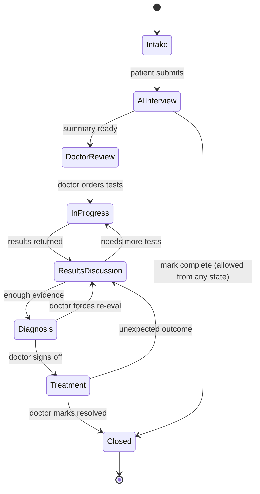
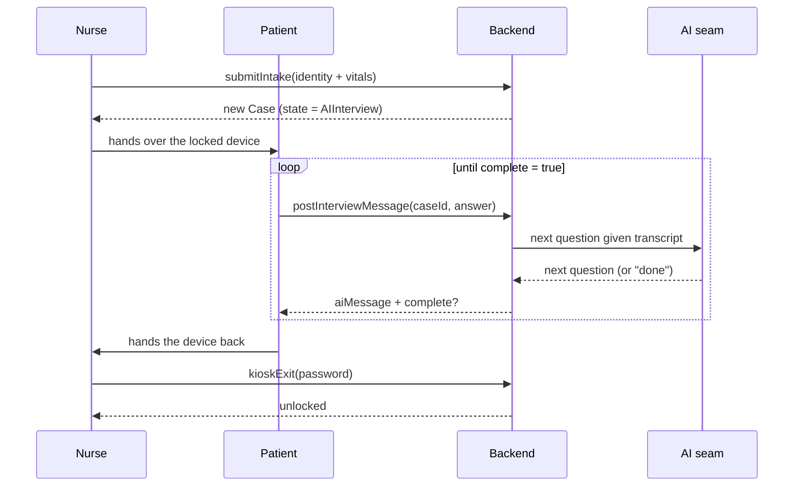
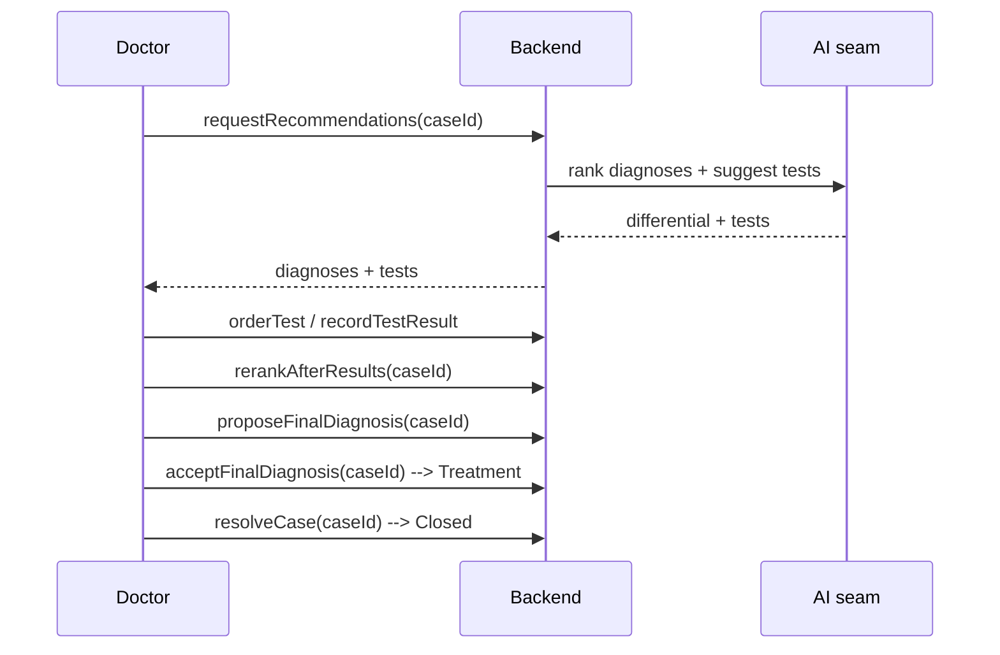

# SEHATI-AI — The Workflow (How a Case Moves)

This page walks a case through its whole life, from the moment a patient describes
their symptoms to the moment a doctor closes the case. For each step you'll see:
**who acts**, **what happens**, **which endpoint is called**, and **how the case
changes**. Exact endpoint inputs/outputs are in [`API.md`](./API.md); the entities
mentioned are in [`DATA_MODEL.md`](./DATA_MODEL.md).

---

## 1. The stages (the "state machine")

A case is always in exactly one **lifecycle state**. It can only move along allowed
arrows — the backend rejects illegal jumps (e.g. you cannot skip from `Intake`
straight to `Diagnosis`). The one exception is `Closed`, which is reachable from
**every** state: the doctor's "Mark complete" action sits in the case header at
all times, because a case doesn't always end by reaching a diagnosis — the
patient is discharged, referred on, or never comes back.

Note where sign-off lands. Accepting a diagnosis does **not** close a case: the
patient still has to be treated, and treatment is where an unexpected outcome
surfaces. So sign-off parks the case in `Treatment`, from which the doctor
either marks it resolved or reopens it.

Each state also maps to the friendlier `status`/`stage` labels the UI shows (e.g.
`InProgress` → "Awaiting Tests"). You don't manage that mapping — the backend keeps
them in sync.

| Lifecycle state | UI status | What it means |
|-----------------|-----------|---------------|
| `Intake` | New | Patient admitted; the nurse's details captured. |
| `AIInterview` | AI Interview | AI is interviewing the patient. |
| `DoctorReview` | Doctor Review | Summary ready; doctor examines and reviews. |
| `InProgress` | Awaiting Tests | Tests have been ordered; waiting on results. |
| `ResultsDiscussion` | Diagnosis in Progress | Results are in; AI + doctor reason over them. |
| `Diagnosis` | Diagnosis in Progress | A final diagnosis has been proposed. |
| `Treatment` | Treatment | Doctor signed off; patient is being treated. Waiting to see how it goes. **Feedback unlocks here.** |
| `Closed` | Completed | Doctor marked the case resolved; record retained immutably. Feedback is still accepted. |

---

## 2. The journey, step by step

Below, **N** = nurse, **P** = patient, **D** = doctor, **AI** = the AI seam,
**Sys** = the backend.

### Step 1 — Admission (nurse takes the patient in)
- **Who:** Nurse.
- **What:** She records what she can measure — name, age, sex, height, weight,
  and vitals (BP, HR, temp, SpO₂). Symptoms and history are deliberately *not*
  on this form; the AI interview asks the patient directly, so a field here
  would mean asking twice.
- **Endpoint:** `submitIntake` (requires `cases.create`)
- **Result:** A new **Case** stamped with `createdByNurseId` from her token —
  ownership is never read from the request body. It immediately moves
  **Intake → AIInterview** and the AI's opening greeting is added.

### Step 2 — AI interview (adaptive Q&A, on a locked device)
- **Who:** Patient ↔ AI, on the nurse's device.
- **What:** She hands the tablet over and it **locks**: routing is pinned to the
  interview page, so the URL bar and the back button lead nowhere, and a
  refresh lands right back in it. The patient answers; the AI asks the next
  targeted question until it has enough. The AI here has no ability to look at
  any other case.
- **Endpoints:** `getInterview` (the kiosk screen's transcript),
  `postInterviewMessage` (once per patient answer, in a loop).
- **Result:** Each turn is appended to the case's `interview`. When the AI
  decides it's done, the response says `complete: true`.

> The transcript is served by its own endpoint rather than read off the case,
> because the device is authenticated as the *nurse* — and a nurse's case
> payload has the clinical content stripped out of it (§3).

### Step 2b — Unlocking the device
- **Who:** Nurse.
- **What:** The only way out of interview mode is the exit password an admin
  set in the admin panel. It is compared server-side against a PBKDF2 hash — a
  check done in the browser would be readable in the shipped JavaScript.
- **Endpoint:** `kioskExit`
- **Result:** The lock clears and she is returned to the case.

### Step 2c — Routing the case to a doctor
- **Who:** Nurse (or admin).
- **What:** She picks a doctor from `listDoctors` and assigns the case.
- **Endpoint:** `assignCase` (requires `cases.assign`)
- **Result:** `assignedPhysicianId`, `assignedAt` and `assignedBy` are set, and
  the move is audit-logged. **This is the moment access is granted** — before
  it, no doctor can open the case at all. Reassignment is allowed (any nurse or
  an admin) and equally logged.

> *Planned, not built:* an AI suggestion for which doctor to route to, based on
> their schedule and current load, their experience with similar cases, and the
> urgency of this one. The seam exists (`resolvers/cases.suggest_assignee`) and
> returns `None` today; filling it in only prefills the nurse's picker — her
> explicit choice always wins.

### Step 3 — Summary (hand-off to the doctor)
- **Who:** Triggered when the interview is complete.
- **What:** The AI turns the raw chat into a **StructuredSummary** (chief complaint,
  history, red flags, timeline…).
- **Endpoint:** `generateSummary`
- **Result:** `summary` is filled in and the case moves **AIInterview → DoctorReview**.
  The doctor now has a tidy write-up instead of a raw transcript.

### Step 3b — The doctor's own consultation recording
- **Who:** The assigned doctor, the first time they open the case.
- **What:** They are asked once whether they have a recording of themselves
  talking to the patient. If they do, it is uploaded, transcribed by AWS
  HealthScribe, and its clinical summary is stored on the case. From then on
  **every** AI step reasons over both accounts — the patient's AI interview and
  the doctor's consultation — because the two capture different things.
- **Endpoints:** `createCaseAudioUpload` (presigned `PUT`; `uploadCaseAudio` is
  the base64 fallback for short clips) → `startTranscription` →
  `transcriptionStatus` (poll) → `setConsultation`.
- **Result:** `consultation.prompted` becomes `true` whichever way it is
  answered, so the question is never asked twice. Saying "no recording" is a
  complete answer: the case then runs on the AI interview alone.

### Step 4 — Doctor review & examination
- **Who:** The **assigned** doctor. A colleague who isn't assigned to this case
  gets a `403` — they cannot see it in any list, or open it by URL.
- **What:** Opens the case, reads the summary, and does a physical examination. The
  AI can suggest which exams matter; the doctor records findings. A recommendation
  isn't a work order — anything the doctor examined that the AI didn't ask for
  goes on the case too.
- **Endpoints:** `getCase` (open it), `recommendExams` (get suggested exams),
  `recordExamFinding` (enter each finding), `addCustomExam` (record one the AI
  didn't suggest).
- **Result:** `exams` get their `finding`/`flag` filled in.

### Step 5 — Stock the workup
- **Who:** Doctor asks; AI proposes.
- **What:** The AI proposes the investigations this presentation needs, each
  with a reason, an expected finding and a diagnostic value. The doctor can also
  add tests they ordered themselves.
- **Endpoints:** `recommendTests`, `addCustomTest`.
- **Result:** `tests` is populated, tagged with the current `testRound`.

### Step 6 — Interrogate the AI (explainability)
- **Who:** Doctor ↔ AI.
- **What:** The doctor challenges the reasoning — "Why this?", "Why not pulmonary
  embolism?", "What would increase your confidence?" — and gets grounded answers.
- **Endpoints:** `askDiagnosis` (about a specific diagnosis) or `assistantChat`
  (about the case in general).
- **Result:** The exchange is saved into that diagnosis's `discussion` (or the
  case `assistantThread`). Nothing else changes — this is pure explanation.

### Step 7 — Order tests
- **Who:** Doctor.
- **What:** Marks the tests they've actually put in as awaiting results, and the
  ones they chose not to run as declined — so no recommendation is left
  dangling.
- **Endpoints:** `orderTest` (or `updateTest` with a `status`).
- **Result:** The test's status becomes `ordered`. **The first order moves the case
  DoctorReview → InProgress** ("Awaiting Tests").

> Optional but encouraged: `acceptRecommendation` / `rejectRecommendation` record
> the doctor's decision (a rejection **must** include a reason). This feeds the
> feedback flywheel and the audit trail.

### Step 8 — Results come back
- **Who:** Doctor / lab system.
- **What:** Enters each result (including a radiologist's report as text — the AI
  never reads the image itself).
- **Endpoint:** `recordTestResult`
- **Result:** The test's `result`/`resultFlag` are filled in and a timeline entry
  is added.

### Step 9 — Analyse the results (the differential)
- **Who:** Doctor asks; AI weighs.
- **What:** The AI compares each recommended test against the result that
  actually came back and decides, honestly, whether that is enough. This is the
  differential — it is driven by results, not by the intake, and it has three
  possible answers:

  | Verdict | What it means | What happens |
  |---------|---------------|--------------|
  | `no_results` | Nothing has been resulted. | It says so and points at the workup. No differential is invented from the intake alone. |
  | `confident` | The results settle it. | `diagnoses` is re-ranked; the case moves **InProgress → ResultsDiscussion**. |
  | `needs_more_tests` | The results narrow the field without closing it. | A fresh round of investigations is written onto the workup and the doctor is told to go and enter their results; the case goes back to **InProgress**. |

- **Endpoint:** `analyzeResults`
- **Result:** On a new round, `testRound` is incremented. Everything the doctor
  ordered or resulted keeps its round number and stays on the case as history;
  recommendations nobody acted on are dropped, since they are the guesses this
  analysis just superseded. The loop repeats until the verdict is `confident`.

  (`rerankAfterResults` still exists and only re-orders the existing list — it
  never asks for anything back. `analyzeResults` is what the UI calls.)

### Step 10 — Propose the final diagnosis
- **Who:** Doctor asks; AI proposes.
- **What:** The AI proposes a **FinalDiagnosis** with an evidence summary, the
  alternatives it ruled out, and a treatment/monitoring/follow-up plan — with an
  honest confidence band.
- **Endpoint:** `proposeFinalDiagnosis`
- **Result:** `finalDiagnosis` is set (status `proposed`) and the case moves
  **ResultsDiscussion → Diagnosis**.

### Step 11 — Doctor signs off (or sends it back)
- **Who:** Doctor.
- **What:** Accepts the final diagnosis (optionally with a note). Or, if not
  convinced, forces a re-evaluation back to results discussion.
- **Endpoint:** `acceptFinalDiagnosis` (to sign off), or `setCaseState` back to
  `ResultsDiscussion` (to re-open).
- **Result:** On accept, `finalDiagnosis.status` becomes `accepted` and the case
  moves **Diagnosis → Treatment**. It stays there until the doctor knows how the
  patient responded.

### Step 12 — Treatment, then resolution (or an unexpected outcome)
- **Who:** Doctor.
- **What:** The case sits in `Treatment` while the patient is actually treated.
  Then one of two things happens. They got better — the doctor marks the case
  resolved and it closes. Or they didn't — the doctor reopens it with an account
  of what actually happened, which withdraws the sign-off, is written onto the
  case as a note the AI reads, and immediately re-runs the results analysis
  (usually producing a new round of tests).
- **Endpoints:** `resolveCase`, `reopenCase`.
- **Result:** **Treatment → Closed**, or **Treatment → ResultsDiscussion**.

### Step 13 — Feedback (at sign-off)
- **Who:** Doctor.
- **What:** Having just judged the AI's reasoning, the doctor says where it was
  right and where it was wrong. This is kept as memory and folded back into that
  doctor's future prompts.
- **When:** The moment the final diagnosis is **accepted** — the UI pops the
  dialog as soon as `acceptFinalDiagnosis` returns, while the reasoning is still
  fresh. It stays available through `Closed`.
- **Endpoint:** `submitFeedback` — which **rejects a case whose final diagnosis
  has not been accepted** (`ValidationError`); only `Treatment` and `Closed`
  take it. That server rule is why this is the single place in the app feedback
  can be given.
- **Result:** Stored per doctor, against this case.

---

## 3. Who is allowed to do what (roles)

There are exactly three kinds of account: **doctor**, **nurse**, **admin**.
Patients never sign in — they only ever hold a nurse's locked device.

| Role | Can do |
|------|--------|
| **nurse** | Admit patients and record vitals, run the interview, attach documents, and route cases to a doctor. Cannot see clinical content. |
| **doctor** | The whole clinical workflow — exams, differential, tests, results, propose and **sign off** diagnoses — on **the cases assigned to them**. |
| **admin** | Everything, plus user/group management, hospital settings, and the audit trail. |

Two rules do the real work, and neither is the AI's job:

**A doctor sees only their own cases.** `assignedPhysicianId` is an access
boundary, not a filter (`db/cases_repo._visible_to`). An unassigned case is
invisible to every doctor.

**A nurse never receives clinical content.** She can reach a case in order to
check her intake and route it, but `interview`, `summary`, `exams`,
`diagnoses`, `tests`, `finalDiagnosis`, `notes`, `insights`, `assistantThread`,
`conversations` and `timeline` are stripped from the response before it leaves
the Lambda (`handler._project_result`). Hiding tabs in the browser would not be
access control — the payload genuinely does not contain them.

See [`ARCHITECTURE.md`](./ARCHITECTURE.md) §5.

This table is each role's **default** — an admin can narrow or extend it per
user from the `/admin` panel's permission groups (e.g. a locum doctor who may
add notes but not sign off). Only an admin can create accounts; there's no
self-signup. The frontend asks `GET /me` for the caller's effective
permissions and gates its screens on those, so it can't disagree with what the
backend enforces.

---

## 4. Side actions (don't drive the state machine, usable at any stage)

These are additive — a doctor can do them at any point in a case's lifecycle;
none of them move `lifecycleState`.

| Action | Endpoint(s) | What happens |
|---|---|---|
| Side conversation | `createConversation`, `postConversationMessage` | An extra chat thread layered on top of the main `interview` — for a return visit or follow-up question, without touching the original transcript. Starting one locks the device the same way admission does. |
| Attach documents | `uploadCaseDocument`, `listCaseDocuments`, `getCaseDocument`, `deleteCaseDocument` | Any number of files per case. Nurses attach referral letters and prior records at admission; doctors add reports. Extracted text feeds `documentContext` (capped ~40k chars, newest first) as AI grounding; downloads go through a 5-minute presigned URL. Only clinical staff can delete. |
| Tag a case privately | `setCaseTags` | Personal labels ("follow up monday") stored on **your** user record, not the case, so nobody else can see them. Read back from `GET /me`. |
| Audio transcription | `createCaseAudioUpload` (or `uploadCaseAudio` for short clips) → `startTranscription` → poll `transcriptionStatus` | A doctor uploads an audio recording; AWS HealthScribe turns it into a structured clinical summary (chief complaint, HPI, review of systems, past medical history) once the job completes. |
| Leave feedback | `submitFeedback` | Free-text feedback on how the AI did on this case — separate from the accept/reject flywheel below, stored per doctor. |
| Manage the reference library | `listResources`, `uploadResource`, `deleteResource` | Not tied to any one case: clinical staff upload/remove tagged guideline documents (e.g. "diabetes") from the Knowledge Base page. The AI seam keyword-matches them against *any* case's chief complaint or a doctor's question and folds matches in as grounding evidence automatically — no per-case action needed. |

## 5. What gets recorded automatically

You don't have to do anything for these — they happen on every relevant action:

- **Audit trail** (`sehati-audit`): every meaningful action is logged with who/what/
  when/AI-version/evidence. Compliance can read it via `caseAudit`.
- **Feedback flywheel** (`sehati-feedback`): every accept/reject is saved with its
  reason, for safely improving the AI later.
- **Timeline & recent updates**: the case's own history feed is kept up to date so
  the UI can show "what just happened".

---

**Next:** [`API.md`](./API.md) gives the exact request and response for every
endpoint named above.
